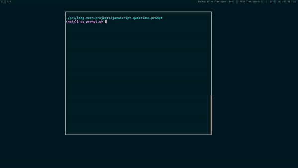

# javascript-questions-prompt

A simple Python script that shows randomly selected questions from [Lydia Hallie's repository of JavaScript questions](https://github.com/lydiahallie/javascript-questions).

## Usage

0. Clone [Lydia Hallie's repository of JavaScript questions](https://github.com/lydiahallie/javascript-questions) and rename it to `questions.md`
1. Run the script: `python3 prompt.py`
2. Write answers (e.g., A) in the prompt below the question and press enter

The prompt will continue to run until all questions have been shown or 'q' has been entered after showing the answer.

A list of statistics will show when the prompt stops.
